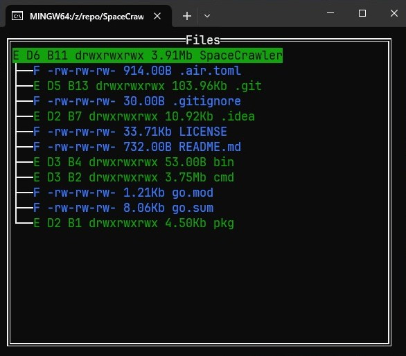

# SpaceCrawler

This is a terminal tool for analyzing folder and file usage. It will quickly run through every file in the working directory and report its size.

It is available in a CLI `cmd/sprawler-cli` and TUI `cmd/sprawler-tui`. Both are stable enough, althought they might also blow up if they encounter a folder/file that has restricted access.

This tool was born out of necessity because windows is awfully slow at reporting folder sizes, and I didn't find any tool which does everything I want.

The tagged version `v1.0.0` has very simple functionality.

## Example

The TUI looks like this:

Use arrow keys to move around, and enter to expand a node in the tree. Q exits the application.

## Warning

Currently, this is using [tview](https://github.com/rivo/tview) for rendering, but it has a knack for exploding and making my terminal unresponsive. I am trying to figure out why this happens still.

# DiskExplorer

The package `pkd/DiskExplorer` contains the core functionality used in both tools, and could be used on its own to build other stuff.

