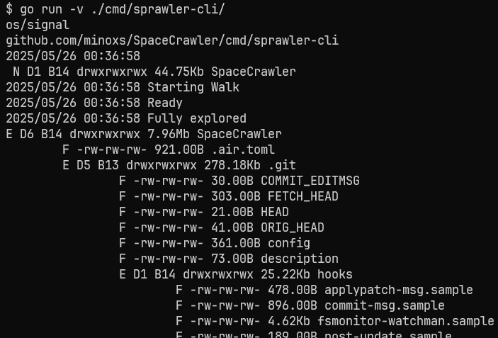

# SpaceCrawler

This is a terminal tool for analyzing folder and file usage.
It will quickly run through every file in the working directory and report its size.
By default it will spawn up to 5000 threads that will run through the folder calculating size and everything.
Files and folders with restricted access will not be counted properly.

This tool was born out of necessity because windows is awfully slow at reporting folder sizes, and I didn't find any tool which does everything I want.

Version `v1.1.1` is simple but functional. 

It is available both as a [CLI](#command-line-interface-cli) `cmd/sprawler-cli` as well as a [TUI](#terminal-user-interface-tui) `cmd/sprawler-tui`.

## Terminal User Interface (TUI)

The TUI will iterate over the current working directory and allows you to move about the file tree figuring out what is taking up space.
It will update in real time as new folders are crawled through.

Use arrow keys to move around, and enter to expand a node in the tree. Q exits the application.

## Command Line Interface (CLI)

The CLI will iterate over the current working directory and render the file tree into stdout; SIGTERM will halt the process early, but still render out to stdout.

# DiskExplorer

The package `pkg/DiskExplorer` contains the core functionality used in both tools, and could be used on its own to build other stuff.
